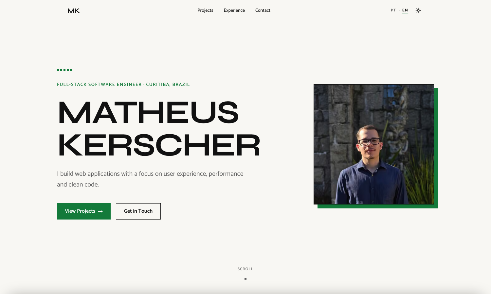

# Portfolio

Personal portfolio of Matheus Kerscher, FullStack developer. The site presents the technologies I work
with, selected projects, my professional experience and ways to get in touch. It is live at
[kerscher.dev.br](https://kerscher.dev.br), in Brazilian Portuguese, and at
[kerscher.dev.br/en](https://kerscher.dev.br/en), in English.



## Stack

- [Next.js](https://nextjs.org) 16 (App Router, Turbopack) and [React](https://react.dev) 19
- [TypeScript](https://www.typescriptlang.org) 6
- [Tailwind CSS](https://tailwindcss.com) 4, with [shadcn/ui](https://ui.shadcn.com) components on
  [Radix UI](https://www.radix-ui.com)
- [Framer Motion](https://www.framer.com/motion) 14 for animations and [Lenis](https://lenis.darkroom.engineering)
  for smooth scrolling
- [next-themes](https://github.com/pacocoursey/next-themes) for the light and dark themes
- [Playwright](https://playwright.dev) with [axe-core](https://github.com/dequelabs/axe-core) for the
  end-to-end and accessibility tests, and [Lighthouse](https://developer.chrome.com/docs/lighthouse) for
  the performance audit

## Getting started

Prerequisites: [Node.js](https://nodejs.org) 22 (`lts/jod`, pinned in [.nvmrc](.nvmrc)) and npm.

```sh
git clone https://github.com/MatheusKerscher/portfolio.git
cd portfolio
npm install
npm run dev
```

The site is served at <http://localhost:3000>.

## Scripts

| Script                        | What it does                                                       |
| ----------------------------- | ------------------------------------------------------------------ |
| `npm run dev`                 | Starts the development server                                      |
| `npm run build`               | Builds for production, including type checking                     |
| `npm start`                   | Serves the production build                                        |
| `npm run lint:eslint:check`   | Runs ESLint                                                        |
| `npm run lint:prettier:check` | Checks formatting with Prettier                                    |
| `npm run lint:prettier:fix`   | Formats the code with Prettier                                     |
| `npm run typecheck`           | Type checks without building                                       |
| `npm run test:e2e`            | Builds the site and runs the Playwright suite against it           |
| `npm run test:e2e:ui`         | Opens the Playwright UI                                            |
| `npm run test:e2e:install`    | Downloads the browsers Playwright needs                            |
| `npm run audit`               | Measures the production build with Lighthouse, mobile and desktop  |
| `npm run assets:pixel`        | Regenerates the pixel-art portrait, the icons and 8-bit thumbnails |
| `npm run commit`              | Opens the Commitizen prompt for a commit                           |
| `npm run update-dependencies` | Interactively updates dependencies                                 |

## Tests

The end-to-end suite runs in Chromium, Firefox, WebKit and two mobile profiles, against the production
build:

```sh
npm run test:e2e:install   # once
npm run test:e2e
```

It covers the stacked sections, the carousels, keyboard focus, the contrast of the colour palette, the
metadata and the structured data, and it runs axe in the light and dark themes. On the width of a phone
it checks that the page is one centred column, that every link and button is a 44 px touch target, and
the full-screen menu. Whatever depends on the copy or on the layout runs in both languages.

## Performance audit

`npm run audit` builds the site, serves it with 40 ms of latency per response and runs Lighthouse five
times with the mobile and the desktop presets. It fails when the median Performance, or any other
category, is below 95. `npm run audit -- --write` also stores the medians in
[src/app/data/audit.json](src/app/data/audit.json), which the site shows in its Inspector; run it after
a change that can affect loading. `npm run audit -- --path=/en` measures the English page.

## Languages

The site has no i18n library. A language is a segment of the route, `src/app/[lang]`, and its copy is a
typed dictionary in [src/app/data/dictionaries/](src/app/data/dictionaries/). Portuguese is the default
and is served without a prefix, through the rewrites of [next.config.ts](next.config.ts).

- **To add or change a text**, edit it in `pt.ts` and in `en.ts`. `en.ts` has to satisfy the shape of
  `pt.ts`, so a key missing in one of them fails `npm run build`.
- **To use it**, a Server Component calls `getDictionary()`. A Client Component does not import a
  dictionary: its parent passes it the strings as props, which keeps the copy out of the browser bundle.
- **To add a language**, add a row to [src/app/data/locales.ts](src/app/data/locales.ts) and a
  dictionary for it in `dictionaries/` and in `dictionaries/inspector/`.

Facts that do not depend on the language (URLs, dates, the section anchors) stay in `site.ts`,
`projects.ts` and `curriculum.ts`.

## Generated assets

The pixel-art portrait, the favicon, the app icons and the 8-bit versions of the project thumbnails are
generated, so they are not edited by hand. `npm run assets:pixel` rebuilds them from
[scripts/assets/portrait-art.jpeg](scripts/assets/portrait-art.jpeg) and from the screenshots in
[public/thumbnails/](public/thumbnails/). To change the portrait, replace that file and run the script.

A project thumbnail, or the one at the top of this file, is captured with
`node scripts/capture-thumbnail.mjs <url> <output.png>`.

The site has an Easter egg. Its two ways in are in
[src/app/components/skin-easter-egg.tsx](src/app/components/skin-easter-egg.tsx).

## Project structure

```
src/
├── app/
│   ├── [lang]/            root layout, home page, Open Graph image and llms.txt, per language
│   ├── components/        page sections and site-specific components
│   └── data/              site facts, projects, curriculum, and the copy in dictionaries/
├── components/ui/         shadcn/ui components
└── lib/                   shared utilities
e2e/                       Playwright tests
scripts/                   Lighthouse audit, asset generation, thumbnail capture
public/                    static assets
.specs/                    specifications for work in flight
```

## Contributing

Commits follow [Conventional Commits](https://www.conventionalcommits.org) and are checked by commitlint
on every commit and pull request. Pull requests also run ESLint, Prettier, the Playwright suite and the
Lighthouse audit.

Work starts as a specification before any code is written. The process is described in
[.specs/README.md](.specs/README.md).

## License

[MIT](LICENSE)
